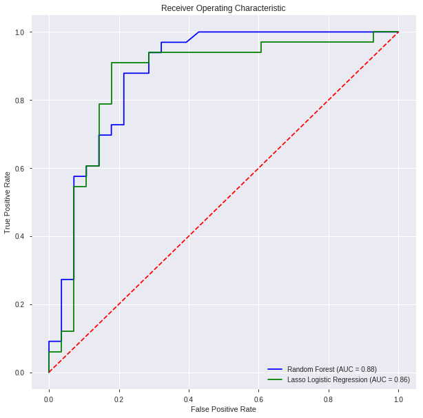
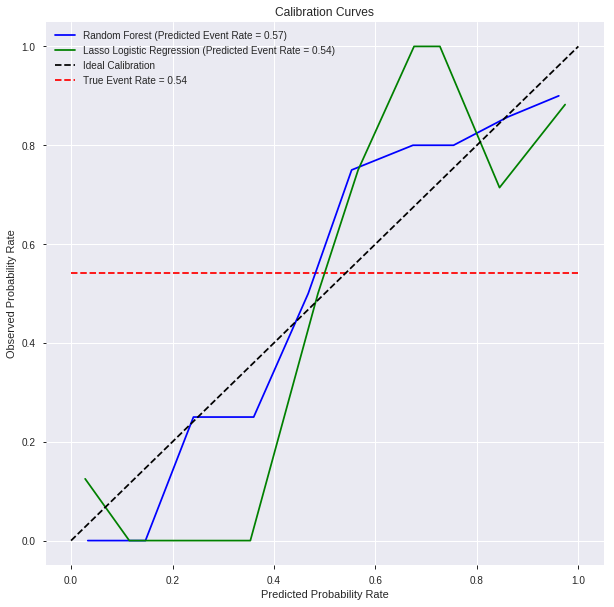

# Heart-Disease-UCI
### Exploring the Heart Disease UCI dataset from Kaggle

This dataset titled [Heart-Disease-UCI](https://www.kaggle.com/ronitf/heart-disease-uci) is taken from Kaggle. 
It's a very clean dataset with no missing values, making model fitting a very straightforward process.
The intention of this repository is to give me a reason to brush up on my model-fitting skills. Here I
decided to use two very basic binary classification tools: the Random Forest and Penalized Logistic Regression.

The goal here is to predict the target variable, which depicts the presence of heart disease in a patient.

A 80%-20% train-test split was conducted before fitting the models. The resulting confusion matrices are as follows:

| Random Forest   | Predicted Negative | Predicted Positive |
|-----------------|--------------------|--------------------|
| Actual Negative | 22                 | 6                  |
| Actual Positive | 4                  | 29                 |

| Lasso Logistic Regression | Predicted Negative | Predicted Positive |
|---------------------------|--------------------|--------------------|
| Actual Negative           | 23                 | 5                  |
| Actual Positive           | 5                  | 28                 |

The results are fairly comparable between the two models. Both models correctly classified 51 of the 61 patients. 
However, Random Forest had one more false positive than Lasso Logistic Regression, whereas Lasso Logistic Regression 
had one more false negative than Random Forest.

The resulting ROC Curves with their respective AUCs
can be seen below:

Additionally, we can see our models' calibration plots (also known as reliability curves). Calibration is basically a measure 
of how well the predicted risk reflects the true risk. For example, if a model predicts the probability of you having
a heart attack is 25%, would you (hypothetically) get a heart attack 25% of the time?

According to our calibration curves, it looks like the Random Forest model is slightly better calibrated than the 
penalized logistic regression model. This means that the predicted probabilities of a patient having a heart disease
better reflect the true risk of patient heart disease in the Random Forest model than in the Lasso Logistic Regression model.
